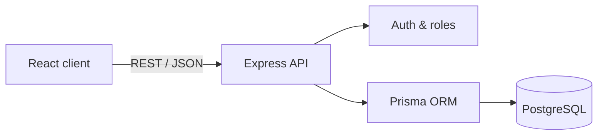

# ClientFlow — PERN Project Management SaaS

A full-stack project-management application demonstrating production-minded React, Node.js, Express, PostgreSQL, REST API, authentication, authorization, validation, security, and responsive UI skills.

## Highlights

- React 19 dashboard styled with Tailwind CSS
- Express REST API with structured routes and middleware
- PostgreSQL relational model through Prisma ORM
- Secure password hashing and HTTP-only cookie authentication
- Role-based access for Admin, Manager, and Member accounts
- Project and task CRUD, comments, filtering, progress, and pagination
- Cloudinary signed-upload and Resend email integration endpoints
- Helmet security headers, CORS policy, rate limiting, and Zod validation
- Responsive desktop and mobile interface
- Docker-based local PostgreSQL setup

## Architecture

## Local setup

1. Install Node.js 20+ and Docker Desktop.
2. Copy `.env.example` to `.env` and keep its development values.
3. Run `docker compose up -d`.
4. Run `npm install`.
5. Run `npm run db:push -w server`.
6. Run `npm run db:seed -w server`.
7. Run `npm run dev`.
8. Open `http://localhost:5173`.

Demo login: `admin@clientflow.dev` / `DemoPass123!`

The frontend also supports the demo login without a database so reviewers can inspect the interface immediately. Full CRUD persistence requires PostgreSQL and the API.

## API overview

| Method | Route | Access |
|---|---|---|
| POST | `/api/auth/register` | Public |
| POST | `/api/auth/login` | Public |
| GET | `/api/auth/me` | Signed in |
| GET | `/api/projects` | Signed in |
| POST/PATCH | `/api/projects` | Admin, Manager |
| DELETE | `/api/projects/:id` | Admin |
| POST | `/api/tasks` | Admin, Manager |
| PATCH | `/api/tasks/:id` | Role/ownership checked |
| POST | `/api/tasks/:id/comments` | Signed in |
| GET | `/api/dashboard` | Signed in |
| POST | `/api/integrations/cloudinary-signature` | Signed in |
| POST | `/api/integrations/invite` | Admin, Manager |

## Security decisions

Passwords use bcrypt with 12 rounds. Sessions use signed JWTs stored in HTTP-only cookies. Authentication endpoints are rate-limited; Helmet adds defensive headers; Zod validates incoming payloads; role and assignment checks prevent unauthorized changes. Secrets are excluded from Git through `.gitignore`.

## Author

**Munazza Shan** — Full-stack web developer
