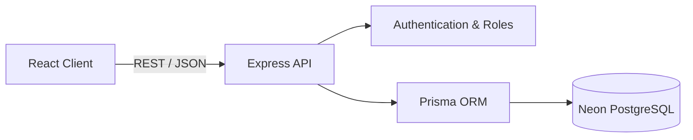

# ClientFlow — PERN Project Management SaaS

A production-minded full-stack project-management application built with React, Node.js, Express, PostgreSQL, and Prisma. ClientFlow demonstrates secure authentication, role-based authorization, REST API development, relational database design, validation, responsive UI, and cloud deployment.

## Live Demo

🌐 **Application:** [Open ClientFlow](https://clientflow-pern-client.vercel.app)

### Demo Account

- **Email:** `admin@clientflow.dev`
- **Password:** `DemoPass123!`

### Backend API

- **Health Check:** [View API Status](https://clientflow-pern-server.vercel.app/api/health)

> The live application uses a deployed Express API and a Neon PostgreSQL database. Please use the demo account to explore the dashboard.

## Highlights

- React 19 dashboard styled with Tailwind CSS
- Express REST API with structured routes and middleware
- PostgreSQL relational database hosted on Neon
- Prisma ORM for database access and schema management
- Secure password hashing and HTTP-only cookie authentication
- Role-based access for Admin, Manager, and Member accounts
- Project and task CRUD operations
- Comments, filtering, progress tracking, and pagination
- Cloudinary signed-upload integration endpoint
- Resend email integration endpoint
- Helmet security headers and controlled CORS policy
- Authentication rate limiting and Zod validation
- Responsive desktop and mobile interface
- Separate frontend and backend Vercel deployments
- Docker-based local PostgreSQL development setup

## Technology Stack

| Area | Technologies |
|---|---|
| Frontend | React 19, Vite, Tailwind CSS |
| Backend | Node.js, Express |
| Database | PostgreSQL, Neon |
| ORM | Prisma |
| Authentication | JWT, HTTP-only cookies, bcrypt |
| Validation | Zod |
| Security | Helmet, CORS, rate limiting |
| Integrations | Cloudinary, Resend |
| Deployment | Vercel |
| Local development | Docker, Docker Compose |

## Architecture



The React client and Express API are deployed as separate Vercel projects. The frontend communicates with the backend through REST endpoints, while Prisma manages database access to PostgreSQL hosted on Neon.

## Core Features

### Authentication and authorization

- Secure user login
- Password hashing with bcrypt
- JWT authentication using HTTP-only cookies
- Admin, Manager, and Member roles
- Protected routes and permission checks

### Project management

- Create, view, update, and delete projects
- Assign project managers
- Track project status and deadlines
- Filter and paginate project records
- View dashboard summaries and progress

### Task management

- Create and assign tasks
- Set priority, status, and due dates
- Add task comments
- Track task completion
- Enforce role and ownership permissions

## API Overview

| Method | Route | Access |
|---|---|---|
| GET | `/api/health` | Public |
| POST | `/api/auth/register` | Public |
| POST | `/api/auth/login` | Public |
| GET | `/api/auth/me` | Signed in |
| GET | `/api/projects` | Signed in |
| POST | `/api/projects` | Admin, Manager |
| PATCH | `/api/projects/:id` | Admin, Manager |
| DELETE | `/api/projects/:id` | Admin |
| POST | `/api/tasks` | Admin, Manager |
| PATCH | `/api/tasks/:id` | Role/ownership checked |
| POST | `/api/tasks/:id/comments` | Signed in |
| GET | `/api/dashboard` | Signed in |
| POST | `/api/integrations/cloudinary-signature` | Signed in |
| POST | `/api/integrations/invite` | Admin, Manager |

## Security Decisions

- Passwords are hashed with bcrypt using 12 rounds.
- Sessions use signed JWTs stored in HTTP-only cookies.
- Authentication endpoints are protected by rate limiting.
- Helmet adds defensive HTTP headers.
- Zod validates incoming request payloads.
- CORS restricts browser access to approved frontend origins.
- Role and assignment checks prevent unauthorized operations.
- Environment variables and secrets are excluded from Git.

## Local Setup

### Requirements

- Node.js 20 or newer
- npm
- Docker Desktop

### Installation

1. Clone the repository:

```bash
git clone https://github.com/munazza-shan-web/clientflow-pern.git
cd clientflow-pern
```

2. Copy `.env.example` to `.env` and configure the development values.

3. Start PostgreSQL:

```bash
docker compose up -d
```

4. Install dependencies:

```bash
npm install
```

5. Create the database schema:

```bash
npm run db:push -w server
```

6. Seed the database:

```bash
npm run db:seed -w server
```

7. Start the application:

```bash
npm run dev
```

8. Open:

```text
http://localhost:5173
```

## Deployment

| Service | Platform |
|---|---|
| Frontend | Vercel |
| Backend API | Vercel |
| PostgreSQL database | Neon |

Production secrets, including `DATABASE_URL` and `JWT_SECRET`, are managed through protected environment variables and are not stored in the repository.

## What This Project Demonstrates

- Full-stack application development
- REST API design
- Relational database modelling
- Authentication and authorization
- Secure production configuration
- Cloud deployment and environment management
- Debugging using deployment and runtime logs
- Responsive interface development
- Git and GitHub workflow

## Author

**Munazza Shan**  
Full-Stack Web Developer

- [GitHub](https://github.com/munazza-shan-web)
- [Portfolio](https://munazza-shan-web.github.io/munazza-shan-web/)
